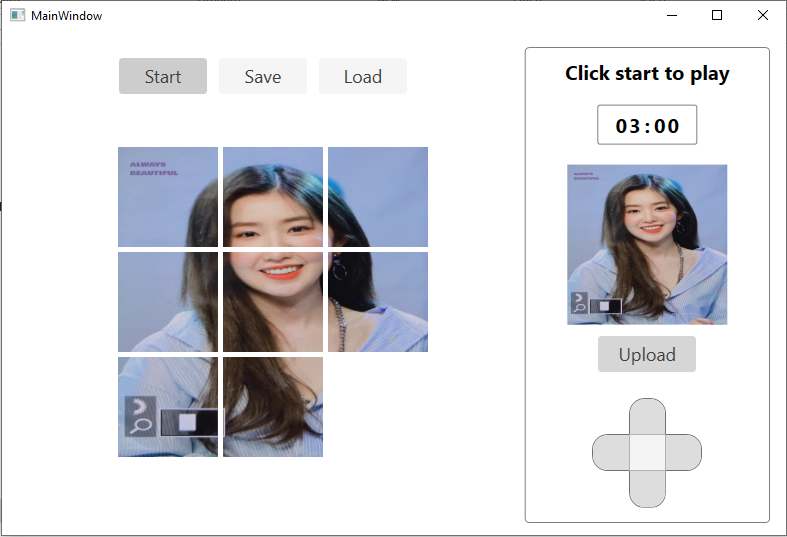

Trò chơi 8 puzzle
Yêu cầu:
1. Chọn hình để cắt ra 8 ô và hiển thị 8 ô này theo một trật tự ngẫu nhiên (cần hiển thị thêm hình gốc ban đầu để người chơi biết)

2. Kéo thả một ô bằng chuột để thay thế

3. Khi kéo thả tự động snap vào ô gần nhất chứ không cần phải kéo chính xác

4. Sử dụng 4 button để điểu khiển với 4 hướng trái, phải, lên, xuống để tự động di chuyển một ô thay thế ô trống

5. Khi bắt đầu chơi game, bật đồng hồ đếm ngược thời gian ví dụ chỉ cho 3 phút

6. Kiểm tra kết quả cuối cùng, thông báo chiến thắng hoặc thua cuộc nếu hết giờ

7. Giao diện gọn gàng, tươm tất, có bắt lỗi dữ liệu nhập đầy đủ

8. Lưu và nạp lại game đang chơi dở dang để chơi tiếp – Chỉ yêu cầu lưu được 1 game là đủ không cần phải lưu nhiều game

